# 设计文档

## 概述

校园墙系统采用前后端分离架构，前端使用 Vue 3 + DaisyUI + Tailwind CSS，后端使用 Java 21 + Spring Boot 3 + Sa-Token。数据层使用 PostgreSQL 作为主数据库，Redis 用于缓存和会话管理。

### 技术栈

| 层级 | 技术选型 |
|------|----------|
| 前端框架 | Vue 3 + Vite |
| UI 组件库 | DaisyUI + Tailwind CSS |
| 状态管理 | Pinia |
| HTTP 客户端 | Axios |
| 后端框架 | Spring Boot 3.2+ |
| 权限认证 | Sa-Token |
| ORM | MyBatis-Plus |
| 数据库 | PostgreSQL 15+ |
| 缓存 | Redis 7+ |
| 数据库迁移 | Flyway |
| 文件存储 | MinIO / 阿里云 OSS /本地存储 |

---

## 架构

### 系统架构图

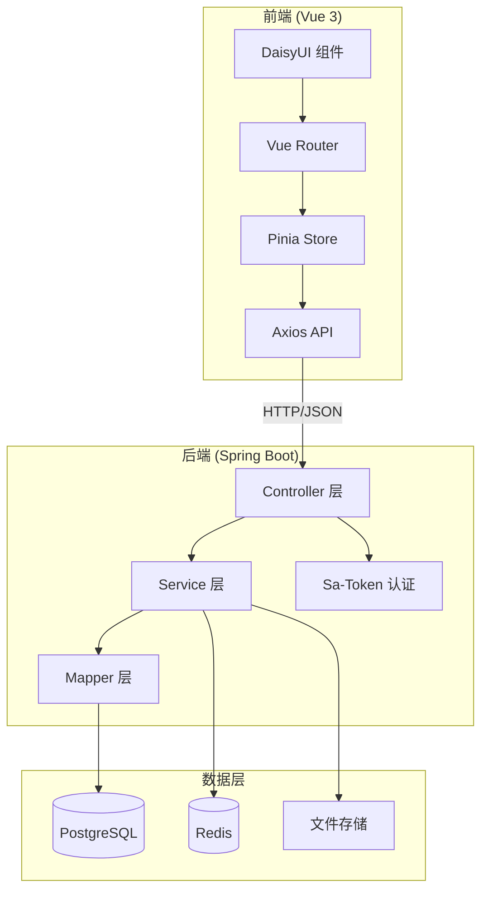

### 目录结构

```
campus-wall/
├── frontend/                    # Vue 3 前端
│   ├── src/
│   │   ├── api/                # API 接口定义
│   │   ├── assets/             # 静态资源
│   │   ├── components/         # 通用组件
│   │   ├── composables/        # 组合式函数
│   │   ├── layouts/            # 布局组件
│   │   ├── pages/              # 页面组件
│   │   ├── router/             # 路由配置
│   │   ├── stores/             # Pinia 状态
│   │   ├── types/              # TypeScript 类型
│   │   └── utils/              # 工具函数
│   ├── index.html
│   ├── package.json
│   ├── tailwind.config.js
│   └── vite.config.ts
│
└── backend/                     # Java 后端
    ├── src/main/java/com/campus/wall/
    │   ├── config/             # 配置类
    │   ├── controller/         # 控制器
    │   ├── service/            # 服务层
    │   ├── mapper/             # MyBatis Mapper
    │   ├── entity/             # 实体类
    │   ├── dto/                # 数据传输对象
    │   ├── vo/                 # 视图对象
    │   ├── common/             # 通用类
    │   └── util/               # 工具类
    ├── src/main/resources/
    │   ├── application.yml
    │   ├── mapper/             # XML 映射文件
    │   └── db/migration/       # Flyway 迁移脚本
    │       ├── V1__init_schema.sql
    │       ├── V2__init_data.sql
    │       └── V3__add_xxx.sql
    └── pom.xml
```

---

## 界面布局设计

### 一、前台布局 (Client Layout)

> 目标：类似 Twitter/微博/Reddit 的流式阅读体验

#### 1. 整体结构：响应式容器

采用 **"固定顶部 + 左右双栏"** 结构：

| 断点 | 布局 | 说明 |
|------|------|------|
| Mobile (< 768px) | 单栏流式 | 顶部导航简化，侧边栏内容移至 Drawer 或底部 |
| Desktop (≥ 1024px) | 双栏布局 | 限制最大宽度 `max-w-7xl`，居中显示 |

- **左侧主内容区 (70%-75%)**：帖子列表、详情、评论
- **右侧挂件区 (25%-30%)**：个人卡片、热门话题、公告、页脚

#### 2. 顶部栏 (Navbar) - 全局吸顶

使用 DaisyUI `navbar` 组件，Flexbox 三段式布局：

| 位置 | 内容 |
|------|------|
| **左侧** | Logo & 名称（点击回首页）、移动端汉堡菜单 |
| **中间** | 全局搜索框（移动端折叠为图标）、板块导航（可选） |
| **右侧** | 发布按钮（Primary）、通知铃铛（带 badge）、主题切换、用户头像下拉菜单 |

**用户头像下拉菜单内容**：
- 个人中心
- 我的帖子
- 管理后台入口（仅管理员可见）
- 登出

#### 3. Hero 区域

仅在 **首页且未登录/首次访问** 时展示：

```vue
<template>
  <div class="hero min-h-[40vh] bg-base-200"
       style="background-image: url('/campus-blur.jpg');">
    <div class="hero-overlay bg-opacity-60"></div>
    <div class="hero-content text-center text-neutral-content">
      <div class="max-w-md">
        <h1 class="text-5xl font-bold">听见 XX 大学的声音</h1>
        <p class="py-6">表白 · 吐槽 · 互助 · 交易</p>
        <button class="btn btn-primary">立即加入</button>
      </div>
    </div>
  </div>
</template>
```

#### 4. 主体网格结构

```html
<div class="container mx-auto px-4 pt-4 grid grid-cols-1 lg:grid-cols-4 gap-6">
  <!-- 主内容区 -->
  <main class="lg:col-span-3 space-y-4">
    <!-- 板块切换 Tabs -->
    <div class="tabs tabs-boxed">
      <a class="tab tab-active">最新</a>
      <a class="tab">最热</a>
      <a class="tab">关注</a>
    </div>
    <!-- 帖子列表 -->
    <PostCard v-for="post in posts" :key="post.id" :post="post" />
  </main>

  <!-- 右侧挂件区 (桌面端显示) -->
  <aside class="hidden lg:block lg:col-span-1 space-y-6">
    <div class="sticky top-20 space-y-6">
      <UserMiniProfile />
      <AnnouncementCard />
      <TrendingTags />
      <FooterSmall />
    </div>
  </aside>
</div>
```

### 二、后台布局 (console Layout)

> 目标：类似 Ant Design Pro / Element console 的高效管理界面

#### 1. 整体结构：侧边栏布局

采用 **"左侧固定侧边栏 + 顶部通栏 + 内容区"** 结构。

```
┌─────────────────────────────────────────────────┐
│                  console Header                    │
├──────────┬──────────────────────────────────────┤
│          │                                       │
│ Sidebar  │           Main Content               │
│  Menu    │                                       │
│          │                                       │
│          │                                       │
└──────────┴──────────────────────────────────────┘
```

#### 2. 侧边栏 (Sidebar) - 权限驱动

使用 DaisyUI `drawer` + `menu` 组件，**按角色动态渲染菜单**：

```
📊 仪表盘 (Dashboard)
📝 内容管理 (Content)
   ├── 帖子管理
   ├── 评论管理
   └── 审核队列 (带红点计数)
👥 用户管理 (Users)
   ├── 用户列表
   └── 角色管理 (仅 console)
⚙️ 系统设置 (System)
   ├── 菜单管理 (仅 console)
   ├── 公告发布
   └── 敏感词库
```

> **权限控制**：版主看不到"系统管理"菜单；管理员能看到所有菜单。

#### 3. 顶部栏 (console Header)

| 位置 | 内容 |
|------|------|
| **左侧** | 面包屑导航 (Breadcrumb)：`首页 > 用户管理 > 角色列表` |
| **右侧** | 返回前台按钮、管理员头像、登出 |

#### 4. 内容区域 (Main Content)

- **卡片式设计**：每个管理模块放入 `card bg-base-100 shadow-xl`
- **操作栏**：顶部搜索栏 + "新增"按钮
- **表格区**：使用 `table table-zebra` 斑马纹表格
- **分页**：底部固定分页器 (`join` 组件)

### 三、DaisyUI 组件速查表

| 区域 | 推荐组件/类名 | 说明 |
|------|---------------|------|
| Navbar | `navbar`, `navbar-start`, `navbar-end` | 灵活的顶部栏 |
| Dropdown | `dropdown`, `dropdown-end` | 头像菜单、移动端菜单 |
| Sidebar Menu | `menu`, `menu-vertical` | 支持嵌套和激活状态 |
| Hero | `hero`, `hero-content`, `hero-overlay` | 自带居中和背景遮罩 |
| Card (帖子) | `card`, `card-body`, `card-actions` | 帖子卡片基础 |
| Avatar | `avatar`, `mask mask-squircle` | 圆角矩形头像 |
| Badge | `badge badge-secondary` | 未读消息数、"置顶"标签 |
| Tabs | `tabs tabs-boxed` | 切换"最新/最热/关注" |
| Table | `table table-zebra table-sm` | 后台管理表格 |
| Modal | `modal`, `modal-box` | 发帖弹窗、确认删除 |
| Toast | `toast toast-top toast-center` | 全局通知提示 |

### 四、布局组件实现

#### DefaultLayout.vue (前台)

```vue
<template>
  <div class="min-h-screen bg-base-200">
    <!-- 顶部导航 -->
    <Navbar />

    <!-- Hero (条件渲染) -->
    <HeroSection v-if="showHero" />
    <!-- 主体内容 -->
    <div class="container mx-auto px-4 py-6 grid grid-cols-1 lg:grid-cols-4 gap-6">
      <main class="lg:col-span-3">
        <slot />
      </main>
      <aside class="hidden lg:block">
        <div class="sticky top-20 space-y-6">
          <slot name="sidebar" />
        </div>
      </aside>
    </div>

    <!-- 底部 -->
    <Footer />
  </div>
</template>
```

#### consoleLayout.vue (后台)

```vue
<template>
  <div class="drawer lg:drawer-open">
    <!-- 侧边栏 -->
    <input id="console-drawer" type="checkbox" class="drawer-toggle" />
    <div class="drawer-content flex flex-col">
      <!-- 顶部栏 -->
      <consoleHeader />
      <!-- 内容区 -->
      <main class="flex-1 p-6 bg-base-200">
        <slot />
      </main>
    </div>
    <div class="drawer-side">
      <label for="console-drawer" class="drawer-overlay"></label>
      <!-- 动态菜单 (权限驱动) -->
      <consoleSidebar :menus="permittedMenus" />
    </div>
  </div>
</template>
```

---

## 组件与接口

### 后端 API 接口设计

#### 认证模块 `/api/v1/auth`

| 方法 | 路径 | 描述 | 权限 |
|------|------|------|------|
| POST | /register | 用户注册 | 公开 |
| POST | /login | 用户登录 | 公开 |
| POST | /logout | 用户登出 | 登录 |
| GET | /info | 获取当前用户信息 | 登录 |
| POST | /verify-email | 发送 EDU 邮箱验证码 | 登录 |
| POST | /confirm-email | 确认 EDU 邮箱验证 | 登录 |

#### 帖子模块 `/api/v1/posts`

| 方法 | 路径 | 描述 | 权限 |
|------|------|------|------|
| GET | / | 获取帖子列表 | 公开 |
| GET | /{id} | 获取帖子详情 | 公开 |
| POST | / | 创建帖子 | 已验证用户 |
| PUT | /{id} | 更新帖子 | 作者 |
| DELETE | /{id} | 删除帖子 | 作者/管理员 |
| POST | /{id}/like | 点赞帖子 | 登录 |
| POST | /{id}/bookmark | 收藏帖子 | 登录 |
| POST | /{id}/report | 举报帖子 | 登录 |

#### 评论模块 `/api/v1/comments`

| 方法 | 路径 | 描述 | 权限 |
|------|------|------|------|
| GET | /post/{postId} | 获取帖子评论 | 公开 |
| POST | / | 创建评论 | 登录 |
| DELETE | /{id} | 删除评论 | 作者/管理员 |

#### 通知模块 `/api/v1/notifications`

| 方法 | 路径 | 描述 | 权限 |
|------|------|------|------|
| GET | / | 获取通知列表 | 登录 |
| PUT | /{id}/read | 标记已读 | 登录 |
| PUT | /read-all | 全部已读 | 登录 |
| WS | /ws/notifications | WebSocket 实时通知连接 | 登录 |

#### 搜索模块 `/api/v1/search`

| 方法 | 路径 | 描述 | 权限 |
|------|------|------|------|
| GET | / | 全局搜索 | 公开 |

#### 文件模块 `/api/v1/files`

| 方法 | 路径 | 描述 | 权限 |
|------|------|------|------|
| POST | /upload | 上传文件 | 登录 |
| DELETE | /{id} | 删除文件 | 作者 |

#### 管理模块 `/api/v1/console`

| 方法 | 路径 | 描述 | 权限 |
|------|------|------|------|
| GET | /users | 用户列表 | 管理员 |
| PUT | /users/{id}/role | 修改用户角色 | 管理员 |
| PUT | /users/{id}/ban | 封禁用户 | 管理员 |
| GET | /reports | 举报列表 | 版主 |
| PUT | /reports/{id} | 处理举报 | 版主 |
| POST | /announcements | 发布公告 | 管理员 |
| GET | /dashboard | 运营数据看板 | 管理员 |

#### 系统管理模块 `/api/v1/system`

| 方法 | 路径 | 描述 | 权限 |
|------|------|------|------|
| GET | /menu/routes | **核心**：获取当前用户的动态路由树 (用于 `router.addRoute`) | 登录 |
| GET | /user/permissions | **核心**：获取当前用户的按钮权限列表 (如 `['post:del', 'user:ban']`) | 登录 |
| GET | /role/list | 获取角色列表 | 管理员 |
| POST | /role | 新增角色 | 管理员 |
| PUT | /role | 修改角色权限 | 管理员 |
| DELETE | /role/{id} | 删除角色 | 管理员 |
| GET | /menu/list | 获取所有菜单列表 (用于菜单管理页面) | 管理员 |

### 前端组件设计

#### 布局组件

- `DefaultLayout.vue` - 默认布局（导航栏 + 内容 + 底部）
- `consoleLayout.vue` - 管理后台布局

#### 页面组件

- `HomePage.vue` - 首页
- `BoardPage.vue` - 板块页面（表白墙/树洞/求助/市集/失物）
- `PostDetailPage.vue` - 帖子详情
- `CreatePostPage.vue` - 发布帖子
- `SearchPage.vue` - 搜索结果
- `ProfilePage.vue` - 个人中心
- `NotificationPage.vue` - 通知中心
- `consoleDashboard.vue` - 管理后台

#### 通用组件

- `PostCard.vue` - 帖子卡片
- `CommentList.vue` - 评论列表
- `ImageUploader.vue` - 图片上传
- `SearchBar.vue` - 搜索栏
- `Pagination.vue` - 分页
- `ThemeSwitcher.vue` - 主题切换

---

## 前端权限设计方案

### 1. 动态路由加载流程 (页面级权限)

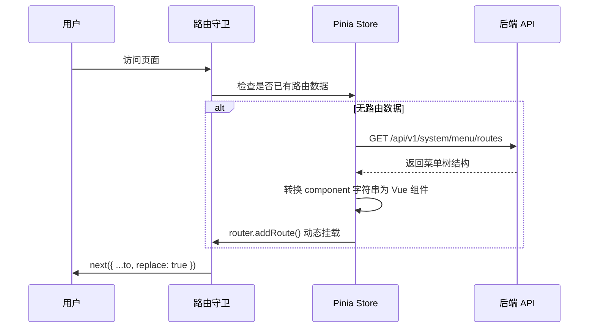

**实现步骤：**

1. **登录阶段**：用户登录成功，获取 Token 存入 Pinia。
2. **路由守卫 (`router.beforeEach`)**：
   - 判断 Pinia 中是否已有路由数据。
   - 若无，调用 `/api/v1/system/menu/routes` 接口。
   - 后端将 `sys_menus` 数据转换为树状结构返回。
   - 前端遍历树结构，将 `component` 字符串路径转换为 Vue 组件对象。
   - 使用 `router.addRoute()` 动态挂载路由。
   - 最后跳转目标页面 (`next({ ...to, replace: true })`)。

**路由数据转换示例：**

```typescript
// 后端返回的路由数据
interface RouteItem {
  name: string
  path: string
  component: string  // 如 'views/system/user/index.vue'
  meta: { title: string; icon: string }
  children?: RouteItem[]
}

// 前端转换函数
const modules = import.meta.glob('@/views/**/*.vue')

function convertRoutes(routes: RouteItem[]): RouteRecordRaw[] {
  return routes.map(route => ({
    name: route.name,
    path: route.path,
    component: modules[`/src/${route.component}`],
    meta: route.meta,
    children: route.children ? convertRoutes(route.children) : undefined
  }))
}
```

### 2. 按钮级权限控制 (自定义指令)

**权限获取：**

登录后调用 `/api/v1/system/user/permissions`，将权限字符数组存入 Pinia。

```typescript
// stores/permission.ts
export const usePermissionStore = defineStore('permission', {
  state: () => ({
    permissions: [] as string[]  // ['post:delete', 'user:ban', ...]
  }),
  actions: {
    async fetchPermissions() {
      const { data } = await api.get('/api/v1/system/user/permissions')
      this.permissions = data
    },
    hasPermission(perm: string | string[]): boolean {
      const perms = Array.isArray(perm) ? perm : [perm]
      return perms.some(p => this.permissions.includes(p))
    }
  }
})
```

**自定义指令实现 (`v-permission`)：**

```typescript
// directives/permission.ts
import type { Directive } from 'vue'
import { usePermissionStore } from '@/stores/permission'

export const permission: Directive<HTMLElement, string[]> = {
  mounted(el, binding) {
    const permissionStore = usePermissionStore()
    const requiredPerms = binding.value

    if (!permissionStore.hasPermission(requiredPerms)) {
      el.parentNode?.removeChild(el)
    }
  }
}

// main.ts 中注册
app.directive('permission', permission)
```

**使用示例：**

```vue
<template>
  <!-- 单个权限 -->
  <button v-permission="['post:delete']" class="btn btn-error">
    删除帖子
  </button>

  <!-- 多个权限 (满足其一即可) -->
  <button v-permission="['user:ban', 'user:delete']" class="btn btn-warning">
    封禁用户
  </button>
</template>
```

### 3. 权限控制流程图

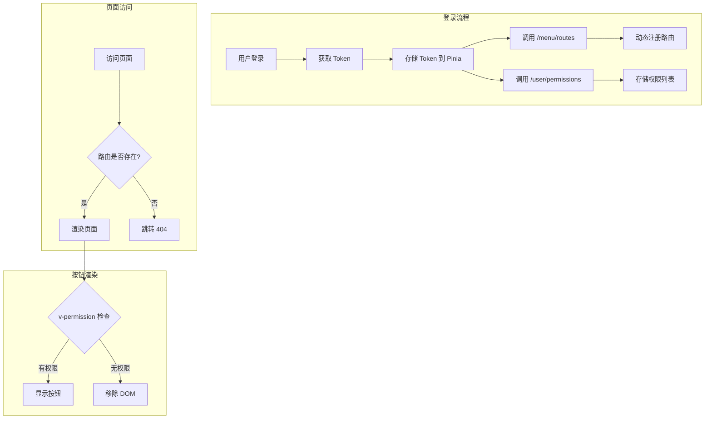

---

## 后端权限实现

### Sa-Token 权限接口实现 (StpInterface)

为了让 `@SaCheckPermission` 和 `@SaCheckRole` 注解生效，后端**必须**实现 `StpInterface` 接口，定义如何从数据库加载用户的权限列表。

```java
/**
 * 自定义权限验证接口扩展
 */
@Component
public class StpInterfaceImpl implements StpInterface {

    @Autowired
    private SysMenuMapper menuMapper;
    @Autowired
    private SysRoleMapper roleMapper;

    /**
     * 返回一个账号所拥有的权限码集合
     * (对应 sys_menus 表的 perms 字段，如 "post:delete")
     */
    @Override
    public List<String> getPermissionList(Object loginId, String loginType) {
        // 1. 转换 loginId (String -> Long)
        Long userId = Long.valueOf(loginId.toString());

        // 2. 超级管理员 (console) 拥有所有权限
        if (userId == 1L) {
            return List.of("*");
        }

        // 3. 从数据库查询该用户的权限列表
        // SQL: SELECT m.perms FROM sys_menus m
        //      LEFT JOIN sys_role_menus rm ON m.id = rm.menu_id
        //      LEFT JOIN sys_user_roles ur ON rm.role_id = ur.role_id
        //      WHERE ur.user_id = ? AND m.type = 2 (按钮)
        return menuMapper.selectPermsByUserId(userId);
    }

    /**
     * 返回一个账号所拥有的角色标识集合
     * (对应 sys_roles 表的 role_key 字段，如 "moderator")
     */
    @Override
    public List<String> getRoleList(Object loginId, String loginType) {
        Long userId = Long.valueOf(loginId.toString());
        return roleMapper.selectRoleKeysByUserId(userId);
    }
}
```

### Mapper 层 SQL 实现

```java
// SysMenuMapper.java
@Mapper
public interface SysMenuMapper extends BaseMapper<SysMenu> {

    /**
     * 根据用户ID查询权限标识列表
     */
    @Select("""
        SELECT DISTINCT m.perms
        FROM sys_menus m
        INNER JOIN sys_role_menus rm ON m.id = rm.menu_id
        INNER JOIN sys_user_roles ur ON rm.role_id = ur.role_id
        WHERE ur.user_id = #{userId}
          AND m.type = 2
          AND m.perms IS NOT NULL
          AND m.perms != ''
        """)
    List<String> selectPermsByUserId(@Param("userId") Long userId);
}

// SysRoleMapper.java
@Mapper
public interface SysRoleMapper extends BaseMapper<SysRole> {

    /**
     * 根据用户ID查询角色标识列表
     */
    @Select("""
        SELECT r.role_key
        FROM sys_roles r
        INNER JOIN sys_user_roles ur ON r.id = ur.role_id
        WHERE ur.user_id = #{userId} AND r.status = 0
        """)
    List<String> selectRoleKeysByUserId(@Param("userId") Long userId);
}
```

### Controller 层使用示例

```java
@RestController
@RequestMapping("/api/v1/console")
public class ConsoleController {

    /**
     * 删除帖子 - 需要 post:delete 权限
     */
    @DeleteMapping("/posts/{id}")
    @SaCheckPermission("post:delete")
    public R<Void> deletePost(@PathVariable Long id) {
        postService.removeById(id);
        return R.ok();
    }

    /**
     * 封禁用户 - 需要 console 或 moderator 角色
     */
    @PutMapping("/users/{id}/ban")
    @SaCheckRole(value = {"console", "moderator"}, mode = SaMode.OR)
    public R<Void> banUser(@PathVariable Long id) {
        userService.banUser(id);
        return R.ok();
    }

    /**
     * 系统配置 - 仅超级管理员可访问
     */
    @GetMapping("/system/config")
    @SaCheckRole("console")
    public R<SystemConfig> getSystemConfig() {
        return R.ok(configService.getConfig());
    }
}
```

> **设计说明**：
> - **超级管理员特权**：`userId == 1` 返回 `*` 权限，避免管理员需要手动配置每个新功能的权限
> - **闭环逻辑**：`sys_menus.perms` 字段通过 `StpInterfaceImpl` 加载给 Sa-Token，使 `@SaCheckPermission` 注解生效
> - **权限缓存**：生产环境建议在 `getPermissionList` 中加入 Redis 缓存，避免每次请求都查询数据库

---

## 数据库迁移设计 (Database Migration)

### Flyway 迁移策略

采用 Flyway 进行数据库版本控制，确保数据库 Schema 变更可追溯、可回滚、可自动化。

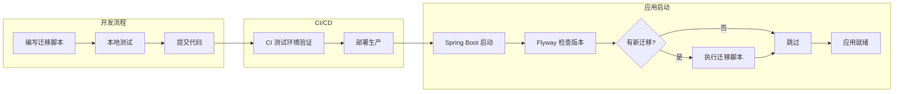

### 迁移脚本命名规范

```
V{版本号}__{描述}.sql

示例：
V1__init_schema.sql          # 初始化表结构
V2__init_data.sql            # 初始化基础数据
V3__add_trace_id_column.sql  # 添加链路追踪字段
V4__create_rate_limit_table.sql  # 创建限流记录表
```

### Maven 依赖配置

```xml
<dependency>
    <groupId>org.flywaydb</groupId>
    <artifactId>flyway-core</artifactId>
</dependency>
<dependency>
    <groupId>org.flywaydb</groupId>
    <artifactId>flyway-database-postgresql</artifactId>
</dependency>
```

### application.yml 配置

```yaml
spring:
  flyway:
    enabled: true
    locations: classpath:db/migration
    baseline-on-migrate: true
    baseline-version: 0
    validate-on-migrate: true
    out-of-order: false
    # 生产环境建议开启
    clean-disabled: true
```

### 迁移脚本示例

#### V1__init_schema.sql

```sql
-- 用户表
CREATE TABLE users (
    id BIGSERIAL PRIMARY KEY,
    username VARCHAR(50) NOT NULL UNIQUE,
    password VARCHAR(255) NOT NULL,
    nickname VARCHAR(50),
    avatar VARCHAR(255),
    email VARCHAR(100),
    status SMALLINT DEFAULT 0,
    created_at TIMESTAMP DEFAULT CURRENT_TIMESTAMP,
    updated_at TIMESTAMP DEFAULT CURRENT_TIMESTAMP
);

-- RBAC 表
CREATE TABLE sys_roles (
    id BIGSERIAL PRIMARY KEY,
    role_name VARCHAR(50) NOT NULL,
    role_key VARCHAR(50) NOT NULL UNIQUE,
    status SMALLINT DEFAULT 0,
    sort_order INT DEFAULT 0,
    created_at TIMESTAMP DEFAULT CURRENT_TIMESTAMP,
    updated_at TIMESTAMP DEFAULT CURRENT_TIMESTAMP
);

-- ... 其他表结构
```

#### V2__init_data.sql

```sql
-- 初始化角色
INSERT INTO sys_roles (role_name, role_key, sort_order) VALUES
('超级管理员', 'console', 1),
('版主', 'moderator', 2),
('普通用户', 'user', 3);

-- 初始化管理员账号 (密码: 123456 的 BCrypt 哈希)
INSERT INTO users (username, password, nickname, status) VALUES
('console', '$2a$10$...', '系统管理员', 0);

-- 初始化菜单
-- ...
```

### 最佳实践

1. **不可变原则**：已执行的迁移脚本不可修改，只能新增
2. **原子性**：每个迁移脚本应是原子操作，失败可回滚
3. **向后兼容**：新版本应兼容旧版本数据
4. **测试先行**：迁移脚本必须在测试环境验证后才能上生产

---

## 信用分系统设计 (Credit Score)

### 信用分规则

| 事件 | 分值变化 | 说明 |
|------|----------|------|
| 举报被核实为欺诈 | -20 | 被举报者扣分 |
| 完成成功交易 | +5 | 买卖双方各加分 |
| 每日活跃 | +1 | 登录/发帖/评论，每日上限 1 分 |
| 信用分上限 | 100 | 不可超过 |
| 市集发帖限制 | < 60 | 低于 60 分禁止发布商品 |

### CreditService 实现

```java
@Service
@Slf4j
public class CreditService {
    
    @Autowired
    private UserMapper userMapper;
    
    private static final int MAX_CREDIT = 100;
    private static final int MIN_CREDIT_FOR_MARKET = 60;
    private static final int FRAUD_PENALTY = -20;
    private static final int TRADE_REWARD = 5;
    private static final int DAILY_ACTIVE_REWARD = 1;
    
    /**
     * 举报核实后扣分
     */
    @Transactional
    public void penalizeForFraud(Long userId) {
        User user = userMapper.selectById(userId);
        int newScore = Math.max(0, user.getCreditScore() + FRAUD_PENALTY);
        userMapper.updateCreditScore(userId, newScore);
        log.info("用户 {} 因欺诈扣分，当前信用分: {}", userId, newScore);
    }
    
    /**
     * 交易成功后加分
     */
    @Transactional
    public void rewardForTrade(Long buyerId, Long sellerId) {
        addCredit(buyerId, TRADE_REWARD, "交易成功");
        addCredit(sellerId, TRADE_REWARD, "交易成功");
    }
    
    /**
     * 每日活跃加分（幂等）
     */
    public void rewardDailyActive(Long userId) {
        String key = "credit:daily:" + userId + ":" + LocalDate.now();
        Boolean isNew = redisTemplate.opsForValue().setIfAbsent(key, "1", 1, TimeUnit.DAYS);
        if (Boolean.TRUE.equals(isNew)) {
            addCredit(userId, DAILY_ACTIVE_REWARD, "每日活跃");
        }
    }
    
    /**
     * 检查是否可以在市集发帖
     */
    public boolean canPostInMarket(Long userId) {
        User user = userMapper.selectById(userId);
        return user.getCreditScore() >= MIN_CREDIT_FOR_MARKET;
    }
    
    private void addCredit(Long userId, int delta, String reason) {
        User user = userMapper.selectById(userId);
        int newScore = Math.min(MAX_CREDIT, user.getCreditScore() + delta);
        userMapper.updateCreditScore(userId, newScore);
        log.info("用户 {} 信用分变化: {} ({}), 当前: {}", userId, delta, reason, newScore);
    }
}
```

---

## 搜索抽象层设计 (Search Abstraction)

### CQRS 模式预留

为未来切换到 ElasticSearch/Meilisearch 预留接口抽象层。

```java
/**
 * 搜索服务接口 - CQRS 抽象层
 */
public interface SearchService {
    
    /**
     * 全局搜索
     */
    Page<PostVO> search(String keyword, SearchFilter filter, Pageable pageable);
    
    /**
     * 索引帖子（创建/更新时调用）
     */
    void indexPost(Post post);
    
    /**
     * 删除索引
     */
    void removeIndex(Long postId);
}

/**
 * PostgreSQL 全文搜索实现（当前使用）
 */
@Service
@Primary
public class PostgresSearchService implements SearchService {
    
    @Autowired
    private PostMapper postMapper;
    
    @Override
    public Page<PostVO> search(String keyword, SearchFilter filter, Pageable pageable) {
        // 使用 tsvector 全文搜索
        return postMapper.fullTextSearch(keyword, filter, pageable);
    }
    
    @Override
    public void indexPost(Post post) {
        // PostgreSQL 通过触发器自动更新 search_vector，无需手动操作
    }
    
    @Override
    public void removeIndex(Long postId) {
        // 软删除时 status 变更，搜索自动排除
    }
}

/**
 * ElasticSearch 实现（未来扩展）
 */
// @Service
// @ConditionalOnProperty(name = "search.engine", havingValue = "elasticsearch")
public class ElasticsearchSearchService implements SearchService {
    // 未来实现
}
```

### 配置切换

```yaml
# application.yml
search:
  engine: postgresql  # 可选: postgresql, elasticsearch, meilisearch
```

---

## 实时通知设计 (WebSocket)

### 架构概述

采用 Spring WebSocket + STOMP 协议实现实时消息推送，避免客户端轮询。

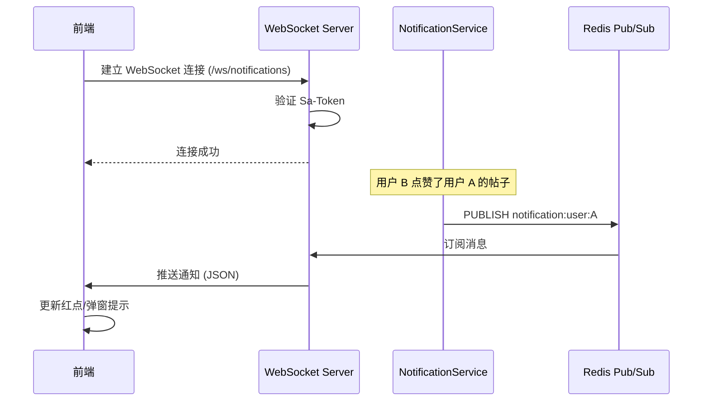

### 后端实现

#### WebSocket 配置

```java
@Configuration
@EnableWebSocketMessageBroker
public class WebSocketConfig implements WebSocketMessageBrokerConfigurer {
    
    @Override
    public void configureMessageBroker(MessageBrokerRegistry config) {
        // 客户端订阅前缀
        config.enableSimpleBroker("/topic", "/queue");
        // 客户端发送前缀
        config.setApplicationDestinationPrefixes("/app");
        // 用户专属队列前缀
        config.setUserDestinationPrefix("/user");
    }
    
    @Override
    public void registerStompEndpoints(StompEndpointRegistry registry) {
        registry.addEndpoint("/ws/notifications")
                .setAllowedOrigins("*")
                .withSockJS();
    }
}
```

#### 通知推送服务

```java
@Service
@Slf4j
public class NotificationPushService {
    
    @Autowired
    private SimpMessagingTemplate messagingTemplate;
    
    /**
     * 推送通知给指定用户
     */
    public void pushToUser(Long userId, NotificationVO notification) {
        String destination = "/queue/notifications";
        messagingTemplate.convertAndSendToUser(
            userId.toString(), 
            destination, 
            notification
        );
        log.info("推送通知给用户 {}: {}", userId, notification.getTitle());
    }
    
    /**
     * 广播全站公告
     */
    public void broadcast(NotificationVO notification) {
        messagingTemplate.convertAndSend("/topic/announcements", notification);
    }
}
```

### 前端实现

```typescript
// composables/useWebSocket.ts
import { Client } from '@stomp/stompjs'
import SockJS from 'sockjs-client'

export function useNotificationSocket() {
  const notificationStore = useNotificationStore()
  let client: Client | null = null
  
  const connect = () => {
    const token = useUserStore().token
    
    client = new Client({
      webSocketFactory: () => new SockJS('/ws/notifications'),
      connectHeaders: { Authorization: `Bearer ${token}` },
      onConnect: () => {
        // 【推拉结合】连接建立后，先拉取未读通知（兜底）
        fetchUnreadNotifications()
        
        // 订阅个人通知
        client?.subscribe('/user/queue/notifications', (message) => {
          const notification = JSON.parse(message.body)
          notificationStore.addNotification(notification)
          // 显示 Toast 提示
          useToast().info(notification.title)
        })
        
        // 订阅全站公告
        client?.subscribe('/topic/announcements', (message) => {
          const announcement = JSON.parse(message.body)
          notificationStore.addAnnouncement(announcement)
        })
      },
      onDisconnect: () => {
        // 断开时记录时间戳，重连后用于拉取断开期间的通知
        notificationStore.setLastDisconnectTime(Date.now())
      }
    })
    
    client.activate()
  }
  
  // 拉取未读通知（兜底策略）
  const fetchUnreadNotifications = async () => {
    const lastDisconnect = notificationStore.lastDisconnectTime
    const params = lastDisconnect ? { since: lastDisconnect } : {}
    const { data } = await api.get('/api/v1/notifications/unread', { params })
    notificationStore.mergeNotifications(data)
  }
  
  const disconnect = () => {
    client?.deactivate()
  }
  
  return { connect, disconnect }
}
```

> **推拉结合策略说明**：
> 1. WebSocket 连接建立后，先调用 HTTP API 拉取未读通知（兜底）
> 2. 断开连接时记录时间戳
> 3. 重连后根据时间戳拉取断开期间的通知
> 4. WebSocket 仅用于实时推送新通知，不依赖其可靠性

### 推拉结合策略详细设计

**问题**: WebSocket 连接不稳定时可能丢失消息，导致用户错过通知。

**解决方案**: 采用"推拉结合"策略，确保消息可靠性。

```typescript
// composables/useNotificationSync.ts
export function useNotificationSync() {
  const notificationStore = useNotificationStore()
  const lastSyncTime = ref<number>(Date.now())

  // 1. 初始化时拉取未读通知
  async function initSync() {
    const unreadList = await api.get('/api/v1/notifications', {
      params: { is_read: false }
    })
    notificationStore.setNotifications(unreadList)
    lastSyncTime.value = Date.now()
  }

  // 2. WebSocket 断开时记录时间戳
  function onDisconnect() {
    localStorage.setItem('ws_disconnect_time', String(Date.now()))
  }

  // 3. 重连后拉取断开期间的通知
  async function onReconnect() {
    const disconnectTime = localStorage.getItem('ws_disconnect_time')
    if (disconnectTime) {
      const missedList = await api.get('/api/v1/notifications', {
        params: { since: disconnectTime }
      })
      notificationStore.mergeNotifications(missedList)
      localStorage.removeItem('ws_disconnect_time')
    }
  }

  // 4. 定时心跳检测 + 兜底拉取（每 5 分钟）
  function startHeartbeat() {
    setInterval(async () => {
      if (!wsClient.connected) {
        await onReconnect()
      }
    }, 5 * 60 * 1000)
  }

  return { initSync, onDisconnect, onReconnect, startHeartbeat }
}
```

**后端支持**: 通知列表接口需支持 `since` 参数

```java
@GetMapping("/api/v1/notifications")
public R<List<NotificationVO>> list(
    @RequestParam(required = false) Boolean is_read,
    @RequestParam(required = false) Long since  // 时间戳，返回该时间之后的通知
) {
    // ...
}
```

---

## 内容安全设计 (Content Security)

### 图片内容审核架构

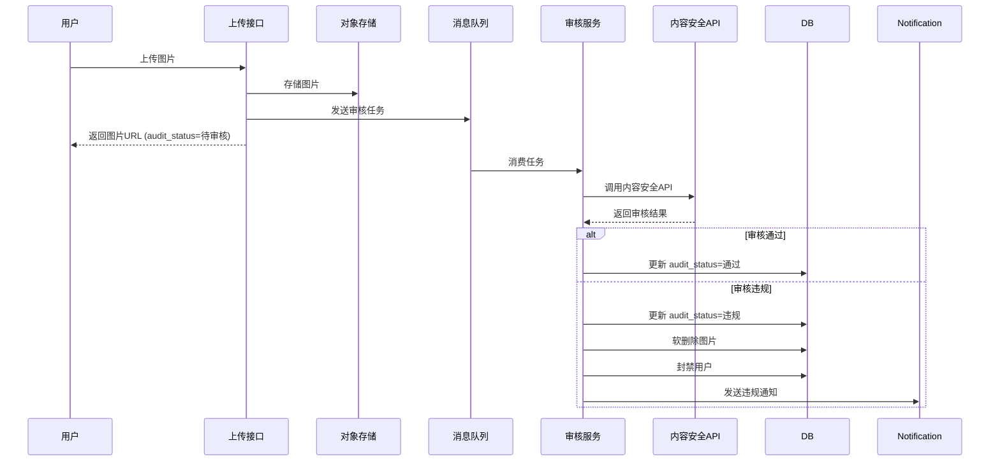

### 内容安全 API 集成

```java
@Service
@Slf4j
public class ContentAuditService {
    
    @Autowired
    private AliyunGreenClient greenClient; // 阿里云内容安全
    
    /**
     * 异步审核图片
     */
    @Async
    public void auditImage(Long fileId, String imageUrl) {
        try {
            // 调用阿里云内容安全 API
            ImageModerationResponse response = greenClient.imageModerationAdvance(
                new ImageModerationAdvanceRequest()
                    .setService("baselineCheck")
                    .setServiceParameters(JSON.toJSONString(Map.of(
                        "imageUrl", imageUrl,
                        "dataId", fileId.toString()
                    )))
            );
            
            // 解析结果
            String suggestion = response.getData().getResult().get(0).getLabel();
            
            if ("pass".equals(suggestion)) {
                fileMapper.updateAuditStatus(fileId, AuditStatus.PASSED);
            } else {
                // 违规处理
                handleViolation(fileId, response);
            }
        } catch (Exception e) {
            log.error("图片审核失败: fileId={}", fileId, e);
            // 审核失败时标记为待人工审核
            fileMapper.updateAuditStatus(fileId, AuditStatus.PENDING_MANUAL);
        }
    }
    
    private void handleViolation(Long fileId, ImageModerationResponse response) {
        // 1. 软删除图片
        fileMapper.softDelete(fileId);
        
        // 2. 获取上传者并封禁
        File file = fileMapper.selectById(fileId);
        userService.banUser(file.getUserId(), "上传违规图片");
        
        // 3. 发送通知
        notificationService.sendViolationNotice(file.getUserId(), "您上传的图片违反社区规范");
        
        log.warn("图片违规处理完成: fileId={}, userId={}", fileId, file.getUserId());
    }
}
```

---

## 密钥安全设计 (Key Management)

### 匿名映射表密钥管理

为防止 `anonymous_mappings` 表泄露导致树洞用户身份暴露，采用云厂商 KMS 进行密钥管理。

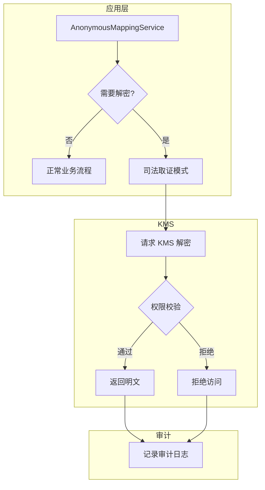

### 实现方案

```java
@Service
public class AnonymousMappingService {
    
    @Autowired
    private KmsClient kmsClient; // 阿里云/AWS KMS 客户端
    
    private static final String KEY_ID = "alias/campus-wall-anonymous";
    
    /**
     * 创建匿名映射（加密存储）
     */
    public void createMapping(Long postId, Long userId) {
        // 使用 KMS 加密
        String plaintext = userId.toString();
        EncryptResponse response = kmsClient.encrypt(
            new EncryptRequest()
                .setKeyId(KEY_ID)
                .setPlaintext(Base64.encode(plaintext.getBytes()))
        );
        
        AnonymousMapping mapping = new AnonymousMapping();
        mapping.setPostId(postId);
        mapping.setUserIdEncrypted(response.getCiphertextBlob());
        mappingMapper.insert(mapping);
    }
    
    /**
     * 解密用户ID（仅司法取证场景）
     * 需要特殊权限 + 审计日志
     */
    @SaCheckPermission("system:forensic:decrypt")
    @AuditLog(action = "DECRYPT_ANONYMOUS_USER", level = "CRITICAL")
    public Long decryptUserId(Long postId, String reason) {
        AnonymousMapping mapping = mappingMapper.selectByPostId(postId);
        if (mapping == null) {
            throw new BusinessException("映射记录不存在");
        }
        
        // 使用 KMS 解密
        DecryptResponse response = kmsClient.decrypt(
            new DecryptRequest()
                .setKeyId(KEY_ID)
                .setCiphertextBlob(mapping.getUserIdEncrypted())
        );
        
        String plaintext = new String(Base64.decode(response.getPlaintext()));
        return Long.parseLong(plaintext);
    }
}
```

### 安全要点

1. **密钥不落地**：解密密钥永远不会出现在应用配置文件或代码中
2. **最小权限**：只有 `system:forensic:decrypt` 权限的超级管理员可以解密
3. **审计追踪**：每次解密操作都会记录到审计日志，包括操作人、时间、原因
4. **访问控制**：KMS 层面配置 IAM 策略，限制只有特定服务账号可以调用解密 API

---

## 搜索优化设计

### PostgreSQL 全文搜索

利用 PostgreSQL 内置的全文搜索功能，避免引入额外组件（如 ElasticSearch），同时保证 10 万级数据量下的搜索性能。

#### 1. 添加全文搜索索引

```sql
-- 添加 tsvector 列
ALTER TABLE posts ADD COLUMN search_vector tsvector;

-- 创建 GIN 索引
CREATE INDEX idx_posts_search ON posts USING GIN(search_vector);

-- 创建触发器自动更新 search_vector
CREATE OR REPLACE FUNCTION posts_search_trigger() RETURNS trigger AS $$
BEGIN
    NEW.search_vector := 
        setweight(to_tsvector('simple', coalesce(NEW.title, '')), 'A') ||
        setweight(to_tsvector('simple', coalesce(NEW.content, '')), 'B');
    RETURN NEW;
END
$$ LANGUAGE plpgsql;

CREATE TRIGGER posts_search_update
    BEFORE INSERT OR UPDATE ON posts
    FOR EACH ROW EXECUTE FUNCTION posts_search_trigger();
```

#### 2. 搜索查询实现

```java
@Repository
public interface PostMapper extends BaseMapper<Post> {
    
    @Select("""
        SELECT p.*, ts_rank(search_vector, query) AS rank
        FROM posts p, plainto_tsquery('simple', #{keyword}) query
        WHERE p.search_vector @@ query
          AND p.status = 0
        ORDER BY rank DESC
        LIMIT #{limit} OFFSET #{offset}
        """)
    List<Post> fullTextSearch(@Param("keyword") String keyword,
                              @Param("limit") int limit,
                              @Param("offset") int offset);
}
```

#### 3. 中文分词支持（可选）

如需更好的中文搜索体验，可安装 `zhparser` 扩展：

```sql
CREATE EXTENSION zhparser;
CREATE TEXT SEARCH CONFIGURATION chinese (PARSER = zhparser);
ALTER TEXT SEARCH CONFIGURATION chinese ADD MAPPING FOR n,v,a,i,e,l WITH simple;
```

---

## 数据模型

### 用户表 (users)

> **注意**: 原有的简单 `role` 字段已移除，改为通过 `sys_user_roles` 关联表查询用户角色，以支持 RBAC 标准模型。

| 字段 | 类型 | 描述 |
|------|------|------|
| id | BIGSERIAL | 主键 |
| username | VARCHAR(50) | 用户名 |
| password | VARCHAR(255) | 密码哈希 |
| nickname | VARCHAR(50) | 昵称 |
| avatar | VARCHAR(255) | 头像URL |
| email | VARCHAR(100) | 邮箱 |
| edu_email | VARCHAR(100) | EDU 邮箱（用于校园身份验证） |
| verify_status | SMALLINT | 验证状态 (0:未验证, 1:准验证/新生, 2:已验证) |
| verify_method | VARCHAR(20) | 验证方式 (EDU_EMAIL/ID_CARD_OCR/MANUAL) |
| student_id | VARCHAR(50) | 学号（可选，用于增强验证） |
| student_id_hash | VARCHAR(64) | 学号哈希（用于防止同一学号注册多个账号） |
| status | SMALLINT | 状态 (0:正常, 1:封禁) |
| credit_score | INT | 信用分（用于市集交易信任体系，默认 100） |
| created_at | TIMESTAMP | 创建时间 |
| updated_at | TIMESTAMP | 更新时间 |

### 身份审核表 (identity_verifications)

> **用途**: 存储学生证/录取通知书人工审核记录

| 字段 | 类型 | 描述 |
|------|------|------|
| id | BIGSERIAL | 主键 |
| user_id | BIGINT | 用户ID |
| image_url | VARCHAR(500) | 证件图片URL |
| status | SMALLINT | 状态 (0:待审核, 1:通过, 2:拒绝) |
| reviewer_id | BIGINT | 审核人ID |
| reject_reason | VARCHAR(255) | 拒绝原因 |
| created_at | TIMESTAMP | 提交时间 |
| reviewed_at | TIMESTAMP | 审核时间 |

### 匿名映射表 (anonymous_mappings)

> **用途**: 存储树洞帖子的真实用户关联，仅用于司法取证场景，加密存储。

| 字段 | 类型 | 描述 |
|------|------|------|
| id | BIGSERIAL | 主键 |
| post_id | BIGINT | 帖子ID |
| user_id_encrypted | VARCHAR(255) | 加密后的用户ID |
| created_at | TIMESTAMP | 创建时间 |

> **安全说明**: `user_id_encrypted` 使用 AES-256 加密，密钥由最高权限管理员保管，仅在司法取证时解密。

### 树洞隐私与楼主标识设计

> **问题**: 树洞帖子需要保护作者隐私，但评论区需要显示"楼主"标识，存在设计悖论。

**解决方案**: 采用"双轨存储"策略

1. **posts.user_id**: 树洞帖子正常存储 `user_id`，但 API 返回时**强制过滤**，不返回给前端
2. **anonymous_mappings**: 额外存储加密映射，用于司法取证
3. **comments.is_owner**: 后端创建评论时，通过 `comment.user_id == post.user_id` 判断并设置 `is_owner=true`
4. **前端显示**: 仅根据 `is_owner` 字段显示"楼主"标识，无需知道真实 user_id

```java
// 树洞帖子详情 API 返回时强制隐藏 user_id
@Override
public PostVO getPostDetail(Long postId) {
    Post post = postMapper.selectById(postId);
    PostVO vo = convertToVO(post);

    // 树洞帖子强制隐藏作者信息
    if ("treehole".equals(post.getBoard())) {
        vo.setUserId(null);
        vo.setAuthorName("匿名用户");
        vo.setAuthorAvatar(null);
    }
    return vo;
}

// 创建评论时判断是否为楼主
@Override
public void createComment(CommentDTO dto) {
    Post post = postMapper.selectById(dto.getPostId());
    Comment comment = new Comment();
    // ...

    // 判断是否为楼主
    comment.setIsOwner(dto.getUserId().equals(post.getUserId()));

    // 树洞帖子分配匿名标识
    if ("treehole".equals(post.getBoard())) {
        comment.setAnonymousId(generateAnonymousId(dto.getUserId(), dto.getPostId()));
        if (comment.getIsOwner()) {
            comment.setAnonymousId("楼主"); // 楼主强制覆写
        }
    }
    commentMapper.insert(comment);
}
```

> **关键点**: 后端可以访问 `post.user_id` 进行楼主判断，但 API 响应中不暴露该字段，前端仅依赖 `is_owner` 布尔值。

---

### 系统权限表 (RBAC Core)

本系统采用 RBAC（基于角色的访问控制）标准模型，支持动态菜单和细粒度的按钮级权限控制。

#### 1. 角色表 (sys_roles)

定义系统中的角色身份。

| 字段 | 类型 | 描述 |
|------|------|------|
| id | BIGSERIAL | 主键 |
| role_name | VARCHAR(50) | 角色名称 (如：普通用户、管理员) |
| role_key | VARCHAR(50) | 权限字符 (如：console, common)，用于 Sa-Token @SaCheckRole |
| status | SMALLINT | 状态 (0:正常, 1:停用) |
| sort_order | INT | 显示顺序 |
| created_at | TIMESTAMP | 创建时间 |
| updated_at | TIMESTAMP | 更新时间 |

#### 2. 菜单权限表 (sys_menus) ⭐️ 核心表

这是实现动态路由和按钮权限的关键。

| 字段 | 类型 | 描述 | 示例 |
|------|------|------|------|
| id | BIGSERIAL | 主键 | |
| parent_id | BIGINT | 父菜单ID | 0 (顶级菜单) |
| name | VARCHAR(50) | 路由名称 | SystemUser |
| path | VARCHAR(200) | 路由路径 | /system/user |
| component | VARCHAR(255) | 组件路径 | views/system/user/index.vue |
| perms | VARCHAR(100) | 权限标识 | system:user:add (用于按钮级控制) |
| icon | VARCHAR(50) | 菜单图标 | setting |
| type | SMALLINT | 类型 | 0:目录, 1:菜单, 2:按钮 |
| visible | BOOLEAN | 是否可见 | true (侧边栏显示) |
| sort_order | INT | 排序 | |
| created_at | TIMESTAMP | 创建时间 | |
| updated_at | TIMESTAMP | 更新时间 | |

#### 3. 用户-角色关联表 (sys_user_roles)

| 字段 | 类型 | 描述 |
|------|------|------|
| user_id | BIGINT | 用户ID (外键 -> users.id) |
| role_id | BIGINT | 角色ID (外键 -> sys_roles.id) |

> 联合主键: (user_id, role_id)

#### 4. 角色-菜单关联表 (sys_role_menus)

| 字段 | 类型 | 描述 |
|------|------|------|
| role_id | BIGINT | 角色ID (外键 -> sys_roles.id) |
| menu_id | BIGINT | 菜单ID (外键 -> sys_menus.id) |

> 联合主键: (role_id, menu_id)

---

### 帖子表 (posts)

| 字段 | 类型 | 描述 |
|------|------|------|
| id | BIGSERIAL | 主键 |
| user_id | BIGINT | 作者ID |
| board | VARCHAR(20) | 板块 (confession/treehole/help/market/lost/freshman) |
| title | VARCHAR(200) | 标题 |
| content | TEXT | 内容 |
| is_anonymous | BOOLEAN | 是否匿名 |
| category | VARCHAR(50) | 分类标签 |
| price | DECIMAL(10,2) | 价格（市集） |
| location | VARCHAR(100) | 地点（失物招领：丢失/拾取地点） |
| lost_time | TIMESTAMP | 丢失/拾取时间（失物招领） |
| status | SMALLINT | 状态 (0:正常, 1:已解决, 2:已删除, 3:待审核, 4:已下架) |
| like_count | INT | 点赞数 |
| comment_count | INT | 评论数 |
| view_count | INT | 浏览数 |
| last_interaction_at | TIMESTAMP | 最后互动时间（用于自动下架判断） |
| created_at | TIMESTAMP | 创建时间 |
| updated_at | TIMESTAMP | 更新时间 |

> **注意**: 图片关联已移至 `files` 表，通过 `target_id` + `target_type` 实现多态关联，避免数据不一致问题。

### 评论表 (comments)

| 字段 | 类型 | 描述 |
|------|------|------|
| id | BIGSERIAL | 主键 |
| post_id | BIGINT | 帖子ID |
| user_id | BIGINT | 评论者ID |
| parent_id | BIGINT | 父评论ID |
| content | TEXT | 内容 |
| anonymous_id | VARCHAR(20) | 匿名标识（树洞，楼主显示为"楼主"） |
| is_owner | BOOLEAN | 是否为帖子作者（用于前端显示楼主标识） |
| status | SMALLINT | 状态 |
| created_at | TIMESTAMP | 创建时间 |

### 点赞表 (likes)

| 字段 | 类型 | 描述 |
|------|------|------|
| id | BIGSERIAL | 主键 |
| user_id | BIGINT | 用户ID |
| post_id | BIGINT | 帖子ID |
| created_at | TIMESTAMP | 创建时间 |

### 收藏表 (bookmarks)

| 字段 | 类型 | 描述 |
|------|------|------|
| id | BIGSERIAL | 主键 |
| user_id | BIGINT | 用户ID |
| post_id | BIGINT | 帖子ID |
| created_at | TIMESTAMP | 创建时间 |

### 举报表 (reports)

| 字段 | 类型 | 描述 |
|------|------|------|
| id | BIGSERIAL | 主键 |
| reporter_id | BIGINT | 举报者ID |
| post_id | BIGINT | 帖子ID |
| reason | TEXT | 举报理由 |
| status | SMALLINT | 状态 (0:待处理, 1:已处理) |
| handler_id | BIGINT | 处理人ID |
| result | VARCHAR(50) | 处理结果 |
| created_at | TIMESTAMP | 创建时间 |
| handled_at | TIMESTAMP | 处理时间 |

### 通知表 (notifications)

| 字段 | 类型 | 描述 |
|------|------|------|
| id | BIGSERIAL | 主键 |
| user_id | BIGINT | 接收者ID |
| type | VARCHAR(20) | 类型 (like/comment/system/report) |
| title | VARCHAR(200) | 标题 |
| content | TEXT | 内容 |
| target_id | BIGINT | 关联对象ID |
| is_read | BOOLEAN | 是否已读 |
| created_at | TIMESTAMP | 创建时间 |

### 公告表 (announcements)

| 字段 | 类型 | 描述 |
|------|------|------|
| id | BIGSERIAL | 主键 |
| title | VARCHAR(200) | 标题 |
| content | TEXT | 内容 |
| publisher_id | BIGINT | 发布者ID |
| status | SMALLINT | 状态 |
| created_at | TIMESTAMP | 创建时间 |

### 敏感词表 (sensitive_words)

| 字段 | 类型 | 描述 |
|------|------|------|
| id | BIGSERIAL | 主键 |
| word | VARCHAR(100) | 敏感词 |
| level | SMALLINT | 级别 (1:警告, 2:拦截) |
| created_at | TIMESTAMP | 创建时间 |

### 文件表 (files)

| 字段 | 类型 | 描述 |
|------|------|------|
| id | BIGSERIAL | 主键 |
| user_id | BIGINT | 上传者ID |
| target_id | BIGINT | 关联对象ID（帖子ID/评论ID等） |
| target_type | VARCHAR(20) | 关联类型 (POST/COMMENT/AVATAR/ID_CARD) |
| filename | VARCHAR(255) | 原始文件名 |
| path | VARCHAR(500) | 存储路径 |
| size | BIGINT | 文件大小 |
| mime_type | VARCHAR(100) | MIME类型 |
| status | SMALLINT | 状态 (0:正常, 1:待清理, 2:已删除) |
| audit_status | SMALLINT | 审核状态 (0:待审核, 1:通过, 2:违规) |
| storage_class | VARCHAR(20) | 存储类型 (STANDARD/IA/ARCHIVE) |
| last_accessed_at | TIMESTAMP | 最后访问时间 |
| created_at | TIMESTAMP | 创建时间 |

> **多态关联说明**: 通过 `target_id` + `target_type` 实现一对多关联，删除帖子时自动级联标记关联图片为待清理状态。

### 图片上传状态管理设计

> **问题**: 用户上传图片后可能放弃发帖，导致"幽灵数据"（无关联的孤儿图片）占用存储空间。

**解决方案**: 采用"先上传后关联"策略，配合定时清理任务。

**状态流转**:
```
上传成功 -> status=0 (正常), target_id=NULL
    |
    v
发帖成功 -> 更新 target_id, target_type
    |
    v
帖子删除 -> status=1 (待清理)
    |
    v
定时任务 -> status=2 (已删除), 物理删除文件
```

**孤儿图片清理规则**:
1. `target_id IS NULL` 且 `created_at < NOW() - INTERVAL '24 hours'` -> 标记为待清理
2. `status = 1` 且 `updated_at < NOW() - INTERVAL '7 days'` -> 物理删除

**实现代码**:

```java
// 定时任务：清理孤儿图片
@Scheduled(cron = "0 0 3 * * ?") // 每天凌晨 3 点执行
public void cleanOrphanFiles() {
    // 1. 标记 24 小时前未关联的图片为待清理
    fileMapper.markOrphanFilesForCleanup();

    // 2. 物理删除 7 天前的待清理图片
    List<File> toDelete = fileMapper.selectFilesToDelete();
    for (File file : toDelete) {
        storageService.delete(file.getPath());
        fileMapper.updateStatus(file.getId(), 2); // 已删除
    }
}

// Mapper SQL
@Update("""
    UPDATE files SET status = 1, updated_at = NOW()
    WHERE target_id IS NULL
      AND status = 0
      AND created_at < NOW() - INTERVAL '24 hours'
""")
void markOrphanFilesForCleanup();

@Select("""
    SELECT * FROM files
    WHERE status = 1
      AND updated_at < NOW() - INTERVAL '7 days'
""")
List<File> selectFilesToDelete();
```

**前端配合**: 发帖时需将已上传图片的 `file_id` 列表传给后端

```typescript
// 发帖请求
const createPost = async (postData: PostDTO) => {
  const res = await api.post('/api/v1/posts', {
    ...postData,
    file_ids: uploadedFileIds.value // 关联已上传的图片
  })
}
```

### 市集订单表 (market_orders)

> **用途**: 记录市集交易的买家信息，实现交易闭环和信用分加分逻辑。

| 字段 | 类型 | 描述 |
|------|------|------|
| id | BIGSERIAL | 主键 |
| post_id | BIGINT | 商品帖子ID (外键 -> posts.id) |
| seller_id | BIGINT | 卖家ID (外键 -> users.id) |
| buyer_id | BIGINT | 买家ID (外键 -> users.id) |
| price | DECIMAL(10,2) | 成交价格 |
| status | SMALLINT | 状态 (0:待确认, 1:已完成, 2:已取消, 3:纠纷中) |
| buyer_confirmed | BOOLEAN | 买家确认收货 |
| seller_confirmed | BOOLEAN | 卖家确认发货 |
| created_at | TIMESTAMP | 创建时间 |
| completed_at | TIMESTAMP | 完成时间 |

> **交易闭环说明**:
> - 买家点击"我想要"创建订单 (status=0)
> - 双方确认后订单完成 (status=1)，触发信用分 +5
> - 任一方可取消 (status=2)
> - 纠纷由管理员介入处理 (status=3)

### ER 图

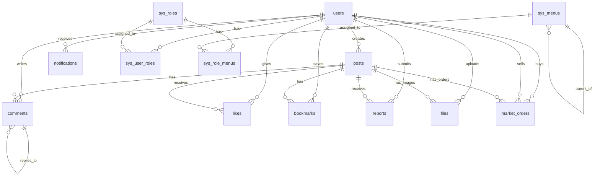

### RBAC 权限模型图

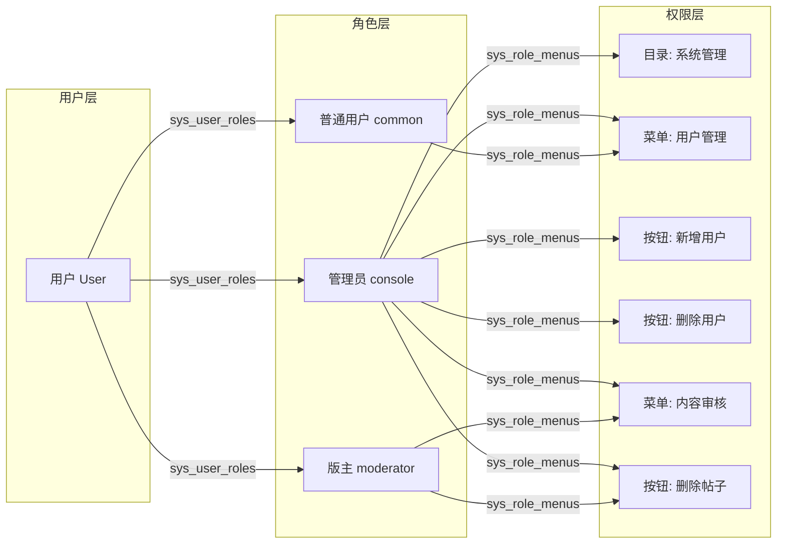

---

### 数据初始化 (Data Seeding)

系统首次启动时，需初始化以下核心数据，确保系统可立即投入使用：

#### 1. 初始角色

| role_key | role_name | 描述 |
|----------|-----------|------|
| console | 超级管理员 | 拥有所有权限，可管理系统配置、用户、角色、菜单 |
| moderator | 版主 | 拥有内容审核权限，可处理举报、删除违规帖子/评论 |
| user | 普通用户 | 仅拥有基础权限，可发帖、评论、点赞、收藏 |

#### 2. 初始菜单

```sql
-- 目录级
INSERT INTO sys_menus (parent_id, name, path, component, type, icon, sort_order) VALUES
(0, 'System', '/system', 'Layout', 0, 'setting', 1),
(0, 'Content', '/content', 'Layout', 0, 'document', 2);

-- 菜单级
INSERT INTO sys_menus (parent_id, name, path, component, type, icon, sort_order) VALUES
(1, 'UserManage', '/system/user', 'views/system/user/index.vue', 1, 'user', 1),
(1, 'RoleManage', '/system/role', 'views/system/role/index.vue', 1, 'peoples', 2),
(1, 'MenuManage', '/system/menu', 'views/system/menu/index.vue', 1, 'tree-table', 3),
(2, 'PostManage', '/content/post', 'views/content/post/index.vue', 1, 'edit', 1),
(2, 'CommentManage', '/content/comment', 'views/content/comment/index.vue', 1, 'message', 2),
(2, 'ReportManage', '/content/report', 'views/content/report/index.vue', 1, 'warning', 3);

-- 按钮级 (以用户管理为例，parent_id 指向 UserManage 菜单)
INSERT INTO sys_menus (parent_id, name, perms, type, sort_order) VALUES
(3, '新增用户', 'system:user:add', 2, 1),
(3, '编辑用户', 'system:user:edit', 2, 2),
(3, '删除用户', 'system:user:delete', 2, 3),
(3, '封禁用户', 'system:user:ban', 2, 4);
```

#### 3. 初始用户

| 用户名 | 密码 | 角色 | 说明 |
|--------|------|------|------|
| console | 123456 | console | 默认超级管理员账号，首次登录后请立即修改密码 |

#### 4. 角色-菜单关联

```sql
-- console 角色拥有所有菜单权限
INSERT INTO sys_role_menus (role_id, menu_id)
SELECT 1, id FROM sys_menus;

-- moderator 角色拥有内容管理权限
INSERT INTO sys_role_menus (role_id, menu_id)
SELECT 2, id FROM sys_menus WHERE path LIKE '/content%' OR parent_id IN (
  SELECT id FROM sys_menus WHERE path LIKE '/content%'
);

-- user 角色无后台管理权限 (仅前台功能)
```

#### 5. 初始化执行策略

```java
@Component
public class DataInitializer implements CommandLineRunner {

    @Autowired
    private SysRoleMapper roleMapper;
    @Autowired
    private SysMenuMapper menuMapper;
    @Autowired
    private UserMapper userMapper;

    @Override
    @Transactional
    public void run(String... args) {
        // 仅在数据库为空时执行初始化
        if (roleMapper.selectCount(null) == 0) {
            initRoles();
            initMenus();
            initRoleMenus();
            initConsoleUser();
            log.info("系统初始化数据已创建");
        }
    }
}
```

---


## 正确性属性

*属性是指在系统所有有效执行中都应保持为真的特征或行为——本质上是关于系统应该做什么的形式化陈述。属性是人类可读规范与机器可验证正确性保证之间的桥梁。*

### 属性反思

在分析验收标准后，识别出以下可合并或冗余的属性：
- 属性 4.1 和 4.2 可合并为"树洞匿名性"属性
- 属性 9.3 和 9.4 可合并为"序列化往返一致性"属性
- 属性 3.4 和 14.3 都涉及匿名性保护，可合并为统一的"匿名性保护"属性

### 核心正确性属性

**Property 1: 认证往返一致性**
*对于任意* 有效用户凭证，登录后登出应使会话失效，再次访问受保护资源应被拒绝
**Validates: Requirements 1.2, 1.4**

**Property 2: 帖子排序一致性**
*对于任意* 板块的帖子列表查询，返回结果应按创建时间降序排列
**Validates: Requirements 3.2**

**Property 3: 匿名性保护**
*对于任意* 设置为匿名的帖子（包括所有树洞帖子），在任何公开视图（列表、详情、搜索结果）中都不应暴露作者身份信息
**Validates: Requirements 3.4, 4.1, 4.2, 14.3**

**Property 4: 树洞评论匿名标识一致性**
*对于任意* 用户在同一树洞帖子下的多条评论，应分配相同的匿名标识符；不同用户应分配不同的匿名标识符
**Validates: Requirements 4.3**

**Property 5: 必填字段验证**
*对于任意* 缺少必填字段的帖子创建请求（求助缺少分类、市集缺少价格/图片、失物招领缺少地点/时间），系统应拒绝创建
**Validates: Requirements 5.1, 6.1, 7.1, 7.2**

**Property 6: 筛选结果正确性**
*对于任意* 带筛选条件的查询，返回的所有结果都应满足指定的筛选条件
**Validates: Requirements 5.2, 6.2, 7.3**

**Property 7: 状态转换后列表排除**
*对于任意* 被标记为已解决/已完成的帖子，不应出现在活跃/开放状态的列表中
**Validates: Requirements 6.4, 7.4**

**Property 8: 删除后不可见性**
*对于任意* 被删除的帖子，不应出现在任何公开列表或搜索结果中
**Validates: Requirements 8.2**

**Property 9: 用户帖子归属正确性**
*对于任意* 用户的个人主页查询，返回的所有帖子都应属于该用户
**Validates: Requirements 8.3**

**Property 10: 收藏往返一致性**
*对于任意* 帖子，收藏后应能在用户的收藏列表中找到该帖子
**Validates: Requirements 8.4**

**Property 11: 序列化往返一致性**
*对于任意* 系统数据对象，JSON 序列化后反序列化应得到等效对象
**Validates: Requirements 9.3, 9.4**

**Property 12: 权限分配即时生效**
*对于任意* 用户，角色分配后应立即具有该角色的所有权限
**Validates: Requirements 11.2**

**Property 13: 权限拒绝正确性**
*对于任意* 无权限用户访问受保护资源，应返回 403 错误
**Validates: Requirements 11.3**

**Property 14: 封禁用户登录拒绝**
*对于任意* 被封禁的用户，登录请求应被拒绝
**Validates: Requirements 11.4**

**Property 15: 举报入队正确性**
*对于任意* 举报操作，被举报的帖子应出现在待审核队列中
**Validates: Requirements 12.1**

**Property 16: 敏感词拦截**
*对于任意* 包含预设敏感词的帖子内容，创建请求应被拦截并转入审核状态
**Validates: Requirements 12.4**

**Property 17: 互动通知生成**
*对于任意* 点赞或评论操作，应为帖子作者生成一条未读通知
**Validates: Requirements 13.1**

**Property 18: 通知排序正确性**
*对于任意* 通知列表查询，结果应按时间降序排列，未读通知应有标识
**Validates: Requirements 13.2**

**Property 19: 公告广播完整性**
*对于任意* 全站公告，所有注册用户都应收到该公告通知
**Validates: Requirements 13.4**

**Property 20: 搜索结果相关性**
*对于任意* 搜索查询，返回的所有结果的标题或内容应包含搜索关键词
**Validates: Requirements 14.1**

**Property 21: 文件格式验证**
*对于任意* 非 JPG/PNG/WEBP 格式或超过 5MB 的文件上传，应被拒绝
**Validates: Requirements 15.1**

**Property 22: 图片压缩有效性**
*对于任意* 成功上传的图片，压缩后的文件大小应小于或等于原文件大小
**Validates: Requirements 15.2**

**Property 23: 链路追踪一致性**
*对于任意* HTTP 请求，响应头中的 X-Trace-Id 应与该请求所有日志记录中的 traceId 一致
**Validates: Requirements 16.1, 16.2, 16.5**

**Property 24: IP 限流正确性**
*对于任意* 单个 IP 在 1 分钟内对同一接口的请求，当请求次数超过 60 次时，后续请求应返回 429 状态码
**Validates: Requirements 17.1**

**Property 25: 用户发帖限流正确性**
*对于任意* 单个用户在 1 分钟内的发帖请求，当发帖次数超过 5 次时，后续请求应被拒绝
**Validates: Requirements 17.2**

**Property 26: 缓存 TTL 随机性**
*对于任意* 写入缓存的数据，其 TTL 应在基础值的基础上有随机偏移，避免大量 Key 同时过期
**Validates: Requirements 17.4**

---

## 可观测性设计 (Observability)

### 链路追踪架构

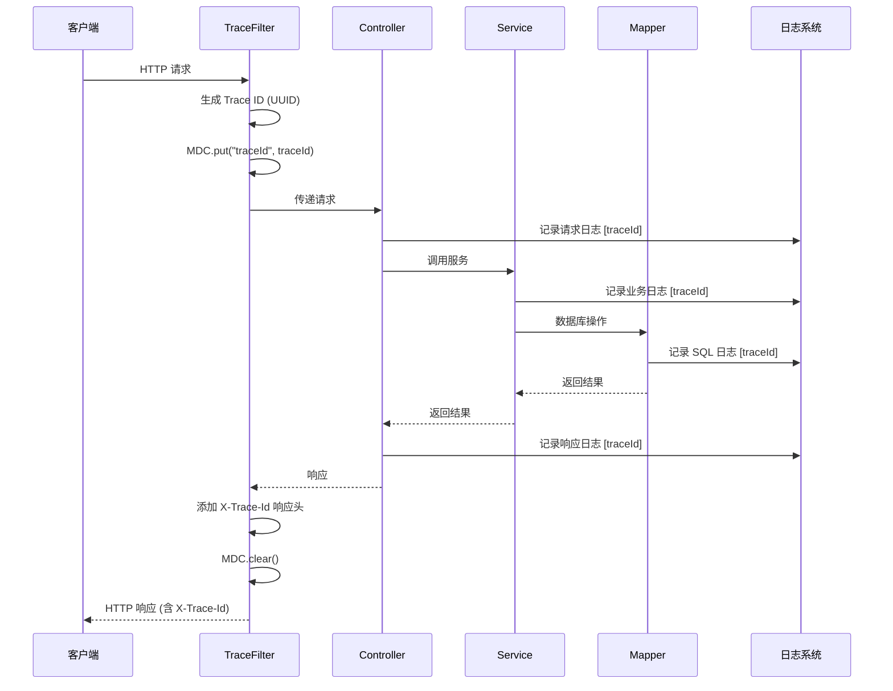

### 核心组件实现

#### 1. TraceFilter (链路追踪过滤器)

```java
@Component
@Order(Ordered.HIGHEST_PRECEDENCE)
public class TraceFilter implements Filter {
    
    private static final String TRACE_ID_HEADER = "X-Trace-Id";
    private static final String TRACE_ID_KEY = "traceId";
    
    @Override
    public void doFilter(ServletRequest request, ServletResponse response, 
                         FilterChain chain) throws IOException, ServletException {
        HttpServletRequest httpRequest = (HttpServletRequest) request;
        HttpServletResponse httpResponse = (HttpServletResponse) response;
        
        // 优先从请求头获取 Trace ID（支持分布式追踪），否则生成新的
        String traceId = httpRequest.getHeader(TRACE_ID_HEADER);
        if (traceId == null || traceId.isEmpty()) {
            traceId = UUID.randomUUID().toString().replace("-", "");
        }
        
        // 放入 MDC
        MDC.put(TRACE_ID_KEY, traceId);
        
        // 添加到响应头
        httpResponse.setHeader(TRACE_ID_HEADER, traceId);
        
        try {
            chain.doFilter(request, response);
        } finally {
            MDC.clear();
        }
    }
}
```

#### 2. RequestLogAspect (请求日志切面)

```java
@Aspect
@Component
@Slf4j
public class RequestLogAspect {
    
    @Around("@within(org.springframework.web.bind.annotation.RestController)")
    public Object logRequest(ProceedingJoinPoint joinPoint) throws Throwable {
        HttpServletRequest request = ((ServletRequestAttributes) 
            RequestContextHolder.getRequestAttributes()).getRequest();
        
        long startTime = System.currentTimeMillis();
        String method = request.getMethod();
        String uri = request.getRequestURI();
        String params = getRequestParams(request, joinPoint);
        
        log.info(">>> [{}] {} | Params: {}", method, uri, params);
        
        try {
            Object result = joinPoint.proceed();
            long costTime = System.currentTimeMillis() - startTime;
            log.info("<<< [{}] {} | Cost: {}ms | Status: 200", method, uri, costTime);
            return result;
        } catch (Exception e) {
            long costTime = System.currentTimeMillis() - startTime;
            log.error("<<< [{}] {} | Cost: {}ms | Error: {}", 
                      method, uri, costTime, e.getMessage(), e);
            throw e;
        }
    }
    
    private String getRequestParams(HttpServletRequest request, 
                                    ProceedingJoinPoint joinPoint) {
        // 脱敏处理：隐藏密码等敏感字段
        // ...
    }
}
```

#### 3. Logback 配置

```xml
<!-- logback-spring.xml -->
<configuration>
    <property name="LOG_PATTERN" 
              value="%d{yyyy-MM-dd HH:mm:ss.SSS} [%thread] [%X{traceId}] %-5level %logger{36} - %msg%n"/>
    
    <appender name="CONSOLE" class="ch.qos.logback.core.ConsoleAppender">
        <encoder>
            <pattern>${LOG_PATTERN}</pattern>
        </encoder>
    </appender>
    
    <appender name="FILE" class="ch.qos.logback.core.rolling.RollingFileAppender">
        <file>logs/campus-wall.log</file>
        <rollingPolicy class="ch.qos.logback.core.rolling.TimeBasedRollingPolicy">
            <fileNamePattern>logs/campus-wall.%d{yyyy-MM-dd}.log</fileNamePattern>
            <maxHistory>30</maxHistory>
        </rollingPolicy>
        <encoder>
            <pattern>${LOG_PATTERN}</pattern>
        </encoder>
    </appender>
    
    <root level="INFO">
        <appender-ref ref="CONSOLE"/>
        <appender-ref ref="FILE"/>
    </root>
</configuration>
```

---

## 高并发防护设计 (Resilience)

### 限流策略架构

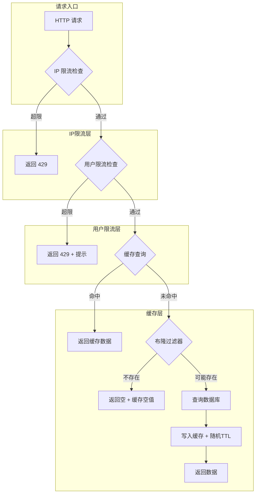

### 核心组件实现

#### 1. RateLimitAspect (限流切面)

```java
@Aspect
@Component
@Slf4j
public class RateLimitAspect {
    
    @Autowired
    private StringRedisTemplate redisTemplate;
    
    /**
     * IP 限流：60次/分钟
     */
    @Before("@annotation(rateLimit)")
    public void checkRateLimit(JoinPoint joinPoint, RateLimit rateLimit) {
        HttpServletRequest request = ((ServletRequestAttributes) 
            RequestContextHolder.getRequestAttributes()).getRequest();
        
        String ip = getClientIp(request);
        String uri = request.getRequestURI();
        String key = "rate_limit:ip:" + ip + ":" + uri;
        
        Long count = redisTemplate.opsForValue().increment(key);
        if (count == 1) {
            redisTemplate.expire(key, 1, TimeUnit.MINUTES);
        }
        
        if (count > rateLimit.limit()) {
            log.warn("IP 限流触发: {} - {} - count: {}", ip, uri, count);
            throw new RateLimitException("请求过于频繁，请稍后再试");
        }
    }
}

/**
 * 限流注解
 */
@Target(ElementType.METHOD)
@Retention(RetentionPolicy.RUNTIME)
public @interface RateLimit {
    int limit() default 60;      // 限制次数
    int window() default 60;     // 时间窗口（秒）
}
```

#### 2. PostRateLimitService (发帖限流)

```java
@Service
public class PostRateLimitService {
    
    @Autowired
    private StringRedisTemplate redisTemplate;
    
    private static final int POST_LIMIT = 5;
    private static final int WINDOW_MINUTES = 1;
    
    public void checkPostLimit(Long userId) {
        String key = "rate_limit:post:" + userId;
        Long count = redisTemplate.opsForValue().increment(key);
        
        if (count == 1) {
            redisTemplate.expire(key, WINDOW_MINUTES, TimeUnit.MINUTES);
        }
        
        if (count > POST_LIMIT) {
            throw new RateLimitException("发帖过于频繁，请 1 分钟后再试");
        }
    }
}
```

#### 3. CacheService (缓存防护)

```java
@Service
@Slf4j
public class CacheService {
    
    @Autowired
    private StringRedisTemplate redisTemplate;
    
    @Autowired
    private ObjectMapper objectMapper;
    
    private static final int BASE_TTL = 300;        // 基础 TTL 5 分钟
    private static final int RANDOM_RANGE = 60;     // 随机偏移 0-60 秒
    private static final String NULL_VALUE = "NULL"; // 空值标记
    
    /**
     * 带防护的缓存查询
     */
    public <T> T getWithProtection(String key, Class<T> type, 
                                    Supplier<T> dbFallback) {
        // 1. 查询缓存
        String json = redisTemplate.opsForValue().get(key);
        
        // 2. 缓存命中
        if (json != null) {
            if (NULL_VALUE.equals(json)) {
                return null; // 缓存穿透防护：返回空值
            }
            return objectMapper.readValue(json, type);
        }
        
        // 3. 缓存未命中，查询数据库
        T data = dbFallback.get();
        
        // 4. 写入缓存（随机 TTL 防雪崩）
        int ttl = BASE_TTL + ThreadLocalRandom.current().nextInt(RANDOM_RANGE);
        if (data == null) {
            // 缓存空值防穿透（较短 TTL）
            redisTemplate.opsForValue().set(key, NULL_VALUE, 60, TimeUnit.SECONDS);
        } else {
            redisTemplate.opsForValue().set(key, objectMapper.writeValueAsString(data), 
                                            ttl, TimeUnit.SECONDS);
        }
        
        return data;
    }
}
```

#### 4. Controller 使用示例

```java
@RestController
@RequestMapping("/api/posts")
public class PostController {
    
    @GetMapping
    @RateLimit(limit = 60, window = 60)  // IP 限流
    public R<Page<PostVO>> listPosts(PostQueryDTO query) {
        return R.ok(postService.listPosts(query));
    }
    
    @PostMapping
    @SaCheckLogin
    @RateLimit(limit = 30, window = 60)
    public R<Long> createPost(@RequestBody @Valid PostCreateDTO dto) {
        // 用户发帖限流
        postRateLimitService.checkPostLimit(StpUtil.getLoginIdAsLong());
        return R.ok(postService.createPost(dto));
    }
}
```

---

## 代码质量管控设计 (Quality Gate)

### 质量门禁架构

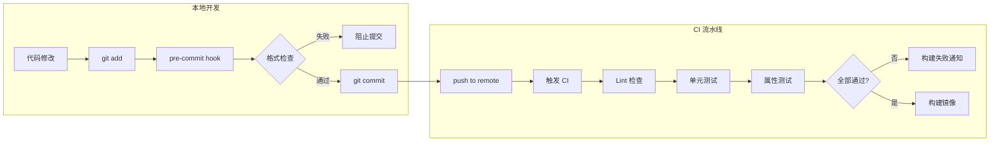

### 前端质量配置

#### 1. ESLint 配置 (.eslintrc.cjs)

```javascript
module.exports = {
  root: true,
  env: {
    browser: true,
    es2021: true,
    node: true
  },
  extends: [
    'eslint:recommended',
    'plugin:vue/vue3-recommended',
    'plugin:@typescript-eslint/recommended',
    'prettier'
  ],
  parser: 'vue-eslint-parser',
  parserOptions: {
    parser: '@typescript-eslint/parser',
    ecmaVersion: 'latest',
    sourceType: 'module'
  },
  rules: {
    'vue/multi-word-component-names': 'off',
    '@typescript-eslint/no-explicit-any': 'warn',
    '@typescript-eslint/no-unused-vars': ['error', { argsIgnorePattern: '^_' }],
    'no-console': process.env.NODE_ENV === 'production' ? 'warn' : 'off'
  }
}
```

#### 2. Prettier 配置 (.prettierrc)

```json
{
  "semi": false,
  "singleQuote": true,
  "tabWidth": 2,
  "trailingComma": "none",
  "printWidth": 100,
  "bracketSpacing": true,
  "arrowParens": "avoid",
  "endOfLine": "lf",
  "vueIndentScriptAndStyle": true
}
```

### 后端质量配置

#### 1. Checkstyle 配置 (checkstyle.xml)

```xml
<?xml version="1.0"?>
<!DOCTYPE module PUBLIC
    "-//Checkstyle//DTD Checkstyle Configuration 1.3//EN"
    "https://checkstyle.org/dtds/configuration_1_3.dtd">
<module name="Checker">
    <property name="charset" value="UTF-8"/>
    <property name="severity" value="error"/>
    
    <module name="TreeWalker">
        <!-- 命名规范 -->
        <module name="ConstantName"/>
        <module name="LocalVariableName"/>
        <module name="MemberName"/>
        <module name="MethodName"/>
        <module name="PackageName"/>
        <module name="ParameterName"/>
        <module name="TypeName"/>
        
        <!-- 代码风格 -->
        <module name="LeftCurly"/>
        <module name="RightCurly"/>
        <module name="WhitespaceAround"/>
        <module name="NoWhitespaceBefore"/>
        
        <!-- 复杂度控制 -->
        <module name="CyclomaticComplexity">
            <property name="max" value="10"/>
        </module>
        <module name="MethodLength">
            <property name="max" value="80"/>
        </module>
    </module>
    
    <!-- 文件级检查 -->
    <module name="FileLength">
        <property name="max" value="500"/>
    </module>
    <module name="NewlineAtEndOfFile"/>
</module>
```

#### 2. Maven 插件配置 (pom.xml)

```xml
<plugin>
    <groupId>org.apache.maven.plugins</groupId>
    <artifactId>maven-checkstyle-plugin</artifactId>
    <version>3.3.1</version>
    <configuration>
        <configLocation>checkstyle.xml</configLocation>
        <consoleOutput>true</consoleOutput>
        <failsOnError>true</failsOnError>
    </configuration>
    <executions>
        <execution>
            <id>validate</id>
            <phase>validate</phase>
            <goals>
                <goal>check</goal>
            </goals>
        </execution>
    </executions>
</plugin>
```

### Git Hooks 配置

#### 1. Husky + lint-staged (前端)

```json
// package.json
{
  "scripts": {
    "lint": "eslint . --ext .vue,.js,.ts,.jsx,.tsx --fix",
    "format": "prettier --write .",
    "prepare": "husky install"
  },
  "lint-staged": {
    "*.{vue,js,ts,jsx,tsx}": [
      "eslint --fix",
      "prettier --write"
    ],
    "*.{css,scss,json,md}": [
      "prettier --write"
    ]
  }
}
```

#### 2. pre-commit hook (.husky/pre-commit)

```bash
#!/usr/bin/env sh
. "$(dirname -- "$0")/_/husky.sh"

# 前端检查
cd frontend && npx lint-staged

# 后端检查 (如果有修改)
cd ../backend
if git diff --cached --name-only | grep -q "^backend/"; then
    mvn checkstyle:check -q
fi
```

---

## CI/CD 设计

### 流水线架构

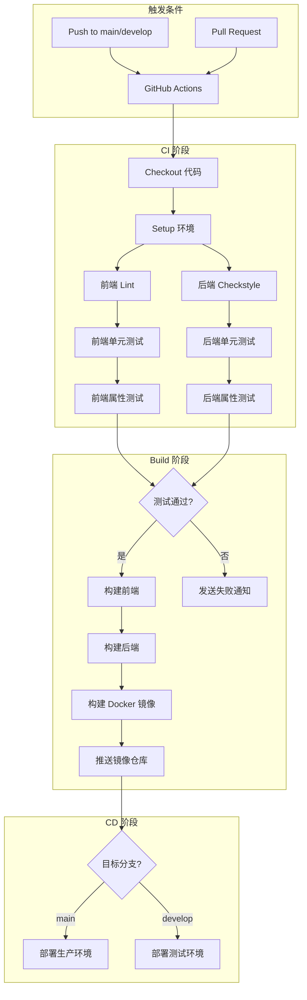

### GitHub Actions 配置

#### 1. CI 工作流 (.github/workflows/ci.yml)

```yaml
name: CI Pipeline

on:
  push:
    branches: [main, develop]
  pull_request:
    branches: [main, develop]

env:
  REGISTRY: ghcr.io
  IMAGE_NAME: ${{ github.repository }}

jobs:
  # ========== 前端检查 ==========
  frontend-lint:
    runs-on: ubuntu-latest
    steps:
      - uses: actions/checkout@v4
      - uses: pnpm/action-setup@v2
        with:
          version: 8
      - uses: actions/setup-node@v4
        with:
          node-version: '20'
          cache: 'pnpm'
          cache-dependency-path: frontend/pnpm-lock.yaml
      - name: Install dependencies
        run: cd frontend && pnpm install
      - name: Lint
        run: cd frontend && pnpm lint
      - name: Type Check
        run: cd frontend && pnpm type-check

  frontend-test:
    needs: frontend-lint
    runs-on: ubuntu-latest
    steps:
      - uses: actions/checkout@v4
      - uses: pnpm/action-setup@v2
        with:
          version: 8
      - uses: actions/setup-node@v4
        with:
          node-version: '20'
          cache: 'pnpm'
          cache-dependency-path: frontend/pnpm-lock.yaml
      - name: Install dependencies
        run: cd frontend && pnpm install
      - name: Unit Tests
        run: cd frontend && pnpm test:unit
      - name: Property Tests
        run: cd frontend && pnpm test:property

  # ========== 后端检查 ==========
  backend-lint:
    runs-on: ubuntu-latest
    steps:
      - uses: actions/checkout@v4
      - uses: actions/setup-java@v4
        with:
          java-version: '21'
          distribution: 'temurin'
          cache: 'maven'
      - name: Checkstyle
        run: cd backend && mvn checkstyle:check

  backend-test:
    needs: backend-lint
    runs-on: ubuntu-latest
    services:
      postgres:
        image: postgres:15
        env:
          POSTGRES_DB: campus_wall_test
          POSTGRES_USER: test
          POSTGRES_PASSWORD: test
        ports:
          - 5432:5432
        options: >-
          --health-cmd pg_isready
          --health-interval 10s
          --health-timeout 5s
          --health-retries 5
      redis:
        image: redis:7
        ports:
          - 6379:6379
    steps:
      - uses: actions/checkout@v4
      - uses: actions/setup-java@v4
        with:
          java-version: '21'
          distribution: 'temurin'
          cache: 'maven'
      - name: Unit & Property Tests
        run: cd backend && mvn test -Dspring.profiles.active=test

  # ========== 构建镜像 ==========
  build:
    needs: [frontend-test, backend-test]
    if: github.event_name == 'push'
    runs-on: ubuntu-latest
    permissions:
      contents: read
      packages: write
    steps:
      - uses: actions/checkout@v4
      
      - name: Setup Node.js
        uses: actions/setup-node@v4
        with:
          node-version: '20'
      
      - name: Setup Java
        uses: actions/setup-java@v4
        with:
          java-version: '21'
          distribution: 'temurin'
          cache: 'maven'
      
      - name: Build Frontend
        run: cd frontend && pnpm install && pnpm build
      
      - name: Build Backend
        run: cd backend && mvn package -DskipTests
      
      - name: Login to Container Registry
        uses: docker/login-action@v3
        with:
          registry: ${{ env.REGISTRY }}
          username: ${{ github.actor }}
          password: ${{ secrets.GITHUB_TOKEN }}
      
      - name: Build and Push Frontend Image
        uses: docker/build-push-action@v5
        with:
          context: ./frontend
          push: true
          tags: ${{ env.REGISTRY }}/${{ env.IMAGE_NAME }}-frontend:${{ github.sha }}
      
      - name: Build and Push Backend Image
        uses: docker/build-push-action@v5
        with:
          context: ./backend
          push: true
          tags: ${{ env.REGISTRY }}/${{ env.IMAGE_NAME }}-backend:${{ github.sha }}

  # ========== 部署 ==========
  deploy-staging:
    needs: build
    if: github.ref == 'refs/heads/develop'
    runs-on: ubuntu-latest
    environment: staging
    steps:
      - name: Deploy to Staging
        run: |
          echo "Deploying to staging environment..."
          # SSH 到服务器执行 docker-compose pull && docker-compose up -d

  deploy-production:
    needs: build
    if: github.ref == 'refs/heads/main'
    runs-on: ubuntu-latest
    environment: production
    steps:
      - name: Deploy to Production
        run: |
          echo "Deploying to production environment..."
          # 生产环境部署脚本

  # ========== 通知 ==========
  notify:
    needs: [frontend-test, backend-test]
    if: failure()
    runs-on: ubuntu-latest
    steps:
      - name: Send Failure Notification
        uses: actions/github-script@v7
        with:
          script: |
            // 发送钉钉/企业微信/邮件通知
            console.log('CI Pipeline Failed!')
```

---

## 错误处理

### HTTP 状态码规范

| 状态码 | 场景 |
|--------|------|
| 200 | 请求成功 |
| 201 | 创建成功 |
| 400 | 请求参数错误 |
| 401 | 未认证 |
| 403 | 无权限 |
| 404 | 资源不存在 |
| 422 | 业务逻辑错误（如敏感词拦截） |
| 500 | 服务器内部错误 |

### 统一响应格式

```json
{
  "code": 200,
  "message": "success",
  "data": {}
}
```

### 错误响应格式

```json
{
  "code": 400,
  "message": "参数校验失败",
  "errors": [
    { "field": "title", "message": "标题不能为空" }
  ]
}
```

---

## 测试策略

### 双重测试方法

本项目采用单元测试和属性测试相结合的方式：

1. **单元测试**：验证具体示例和边界情况
2. **属性测试**：验证应在所有输入上成立的通用属性

### 属性测试框架

- **后端 (Java)**：使用 jqwik 框架
- **前端 (TypeScript)**：使用 fast-check 框架

### 测试配置

- 每个属性测试至少运行 100 次迭代
- 每个属性测试必须注释引用设计文档中的正确性属性

### 测试注释格式

```java
// **Feature: campus-wall, Property 3: 匿名性保护**
@Property
void anonymousPostsShouldNotExposeAuthor(@ForAll Post post) {
    // ...
}
```

```typescript
// **Feature: campus-wall, Property 11: 序列化往返一致性**
test.prop([fc.record({...})])('serialization round trip', (data) => {
    // ...
})
```

### 测试覆盖重点

1. **认证模块**：登录/登出往返、会话管理
2. **权限模块**：角色分配、权限验证、封禁逻辑
3. **帖子模块**：CRUD 操作、匿名性保护、筛选排序
4. **通知模块**：通知生成、排序、已读状态
5. **搜索模块**：关键词匹配、匿名性保护
6. **文件模块**：格式验证、大小限制、压缩处理

---

## 十八、数据安全与备份

### 备份策略

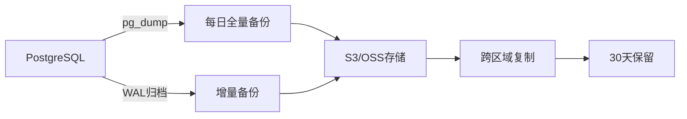

### 备份配置

| 备份类型 | 频率 | 保留期 | 存储位置 |
|---------|------|--------|---------|
| 全量备份 | 每日 02:00 | 30 天 | S3/OSS |
| 增量备份 | 每小时 | 7 天 | S3/OSS |
| WAL 归档 | 实时 | 7 天 | S3/OSS |

### 备份脚本

```bash
#!/bin/bash
# backup.sh - PostgreSQL 每日备份脚本

DATE=$(date +%Y%m%d_%H%M%S)
BACKUP_DIR="/backup/postgres"
S3_BUCKET="s3://campus-wall-backup/postgres"

# 执行全量备份
pg_dump -h localhost -U campus_wall -Fc campus_wall > ${BACKUP_DIR}/full_${DATE}.dump

# 上传到 S3/OSS
aws s3 cp ${BACKUP_DIR}/full_${DATE}.dump ${S3_BUCKET}/full_${DATE}.dump

# 清理本地旧备份 (保留 7 天)
find ${BACKUP_DIR} -name "*.dump" -mtime +7 -delete
```

### 恢复流程

```bash
#!/bin/bash
# restore.sh - 数据库恢复脚本

BACKUP_FILE=$1
DB_NAME="campus_wall"

# 从 S3 下载备份
aws s3 cp s3://campus-wall-backup/postgres/${BACKUP_FILE} /tmp/restore.dump

# 恢复数据库
pg_restore -h localhost -U campus_wall -d ${DB_NAME} -c /tmp/restore.dump
```

---

## 十九、数据生命周期管理

### 数据保留策略

| 数据类型 | 活跃期 | 归档期 | 物理删除 |
|---------|--------|--------|---------|
| 普通帖子 | 永久 | - | 用户删除后 7 天 |
| 二手交易帖 | 30 天 | 90 天后归档 | 归档后 1 年 |
| 失物招领帖 | 60 天 | 90 天后归档 | 归档后 1 年 |
| 图片文件 | 90 天 | 降级存储 | 帖子删除后 7 天 |
| 用户通知 | 30 天 | 自动清理 | - |
| 操作日志 | 90 天 | 归档存储 | 归档后 2 年 |

### 自动归档任务

```java
@Component
@RequiredArgsConstructor
public class DataLifecycleTask {

    private final PostMapper postMapper;
    private final FileService fileService;

    /**
     * 每日凌晨 3 点执行归档任务
     */
    @Scheduled(cron = "0 0 3 * * ?")
    public void archiveExpiredPosts() {
        // 归档超过 30 天的二手交易帖
        postMapper.archiveByTypeAndAge(PostType.MARKET, 30);

        // 归档超过 60 天的失物招领帖
        postMapper.archiveByTypeAndAge(PostType.LOST_FOUND, 60);
    }

    /**
     * 每日凌晨 4 点清理已删除数据
     */
    @Scheduled(cron = "0 0 4 * * ?")
    public void purgeDeletedData() {
        // 物理删除 7 天前软删除的帖子
        postMapper.purgeDeletedBefore(LocalDateTime.now().minusDays(7));

        // 清理孤立的文件
        fileService.cleanOrphanFiles();
    }
}
```

### 存储降级策略

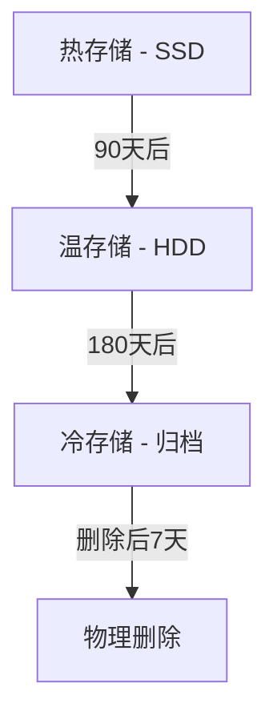
